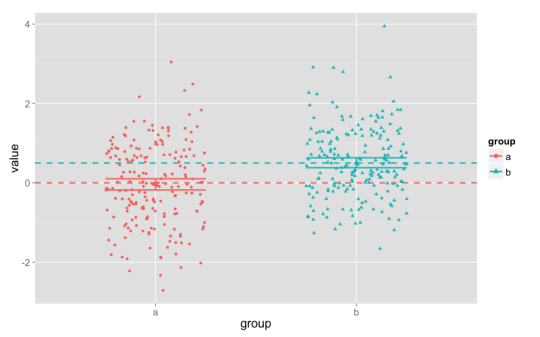

Somehow [this piece](http://waitbutwhy.com/2015/07/why-im-always-late.html) on the character traits of chronically late people showed up several times on my Facebook feed this morning. The sweeping generalizations in the quotations reminded me that I've been meaning to write a post on a common fallacy that I like to call *statistical essentialism*. In this fallacy, we erroneously move from claims about statistical patterns in a group as a whole to claims about "all" or "typical" members of a group.

Statistical essentialism is especially common and pernicious in the context of research on sex, gender, and race. Consider [research findings](https://www.google.com/search?site=&tbm=isch&source=hp&biw=1022&bih=655&q=race%252C+IQ&btnG=Search+by+image&oq=MONKEY&gs_l=img.3..0l10.36585.37105.0.37393.6.5.0.1.1.0.78.335.5.5.0....0...1ac.1.25.img..0.6.337.XIifpFb0si4&gws_rd=ssl#gws_rd=ssl&imgrc=_) that African-Americans have, on average, lower scores on IQ tests than Caucasian-Americans. Strictly speaking, this research finds a statistical pattern concerning the average: the mean of scores for African-Americans is lower than the mean of scores for Caucasian-Americans. This is not a claim about any particular individuals, and indeed by itself it doesn't imply anything about any particular individual. It doesn't even imply that, given an arbitrary African-American and an arbitrary Caucasian-American, the Caucasian-American would probably have a higher IQ score than the African-American.

To understand why statistical essentialism is fallacious, consider the following computer simulation experiment. Suppose we have two groups, A and B, and that we measure 200 members of each group using some test or measurement. (To make things easier to read, I'll call the result of the measurement a "score," but it could also be something like height or weight.) Suppose, in addition, that in the whole population of people in group A, their mean score is 0. And for the whole population of people in group B, their mean score is 0.5. Finally, assume that the distribution of scores for both groups is Gaussian (sometimes misleadingly called a "normal" distribution, or even more misleadingly a "bell curve"), with a standard variation of 1.

Here is what the resulting data might look like:  

In this plot, the points are each of the 400 scores, with different columns, colors, and shapes for the two groups. The dashed horizontal lines show the population mean scores (0 and 0.5), and the shorter horizontal lines show the upper and lower bounds of a 95% confidence interval for our data (they're fairly narrow, about 0.25 wide). (There's also a slightly larger point showing the observed mean. In this case, the mean is close to the population mean for both groups.) Each column has 200 points, centered around the values of 0 and 0.5, but spread out quite far up and down the plot. The points have been jittered --- spread out a bit within their columns, to the left and right --- in order to make them easier to see.

This is a statistically powerful study, and it easily detects a statistically significant difference between groups A and B. (In fact, if we re-ran this study, more than 99% of the time we would detect the difference between the groups as statistically significant.)

But the fact that the mean for group A is 0 doesn't mean that every individual score is right at 0: the scores range between about -3 and +3. Here we've included confidence intervals, but they also doesn't represent where "many" or the "typical" individuals are.^[1](#fn:1){.footnote-ref}^ These statistics tell us that *on the whole*, the scores for group A are clustered around 0, but that's a pattern in the group, not a prediction for an individual.

So the mean --- even in a fairly large, statistically powerful study --- doesn't tell us what the score will be for a "typical" individual. In the same way, the fact that there's a statistically significant difference between groups A and B doesn't tell us that "typically" members of group B have higher scores than members of group A. In fact, about 35% of the members of group A have higher scores than the group B mean; and about 27.5% of the members of group B have lower scores than the group A mean. And when we pair up one member of A and one member of B from our sample, about 35% of the time the A individual will have a higher score than the B individual.

I call this fallacy "statistical essentialism" because it often seems to involve some thinking that the statistical pattern points to an essence or ingrained nature. In terms of our example, "the mean score in group A is 0" is reinterpreted as "the essence of group A-ness is to have a score of 0." With two groups, "the mean of group B is statistically significantly higher than the mean of group A" is replaced with "Bs have a higher score than As," meaning "the B-essence has a higher score than the A-essence."

One way to resist statistical essentialism is to think in focus on distributions and variation, rather than single numbers. In the example, the mean values for the two groups are statistically significantly different. But the distributions --- the full range of scores --- have considerable overlap. Just knowing the mean isn't enough for us to reconstruct the distribution that produced our sample. We also need to know the standard deviation, or some other measure of variation.

::: {.footnotes role="doc-endnotes"}

------------------------------------------------------------------------

1.  ::: {#fn:1}
    Readers who know some statistics will already know this: the confidence interval is better understood as a measure of how precise our estimate of the mean is (though even this is a little sketchy), and not at all an estimate of the range for the "typical" members of the group. [↩︎](#fnref:1){.footnote-backref}
    :::
:::

::: {#footer}
[ July 9th, 2015 2:02pm ]{#timestamp} [statistics]{.tag} [logical fallacies]{.tag}
:::

