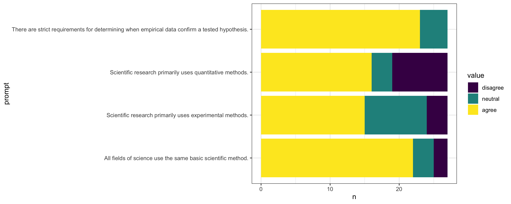
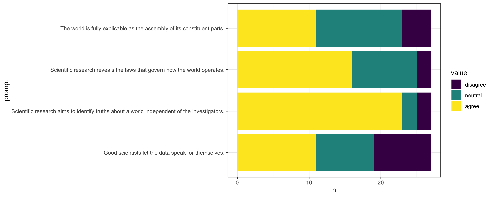
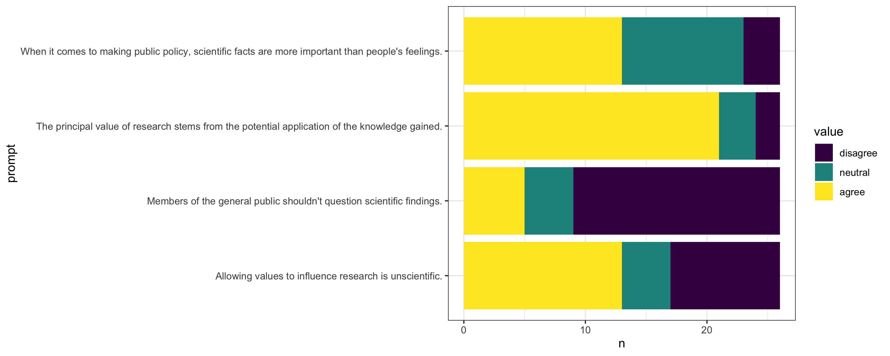
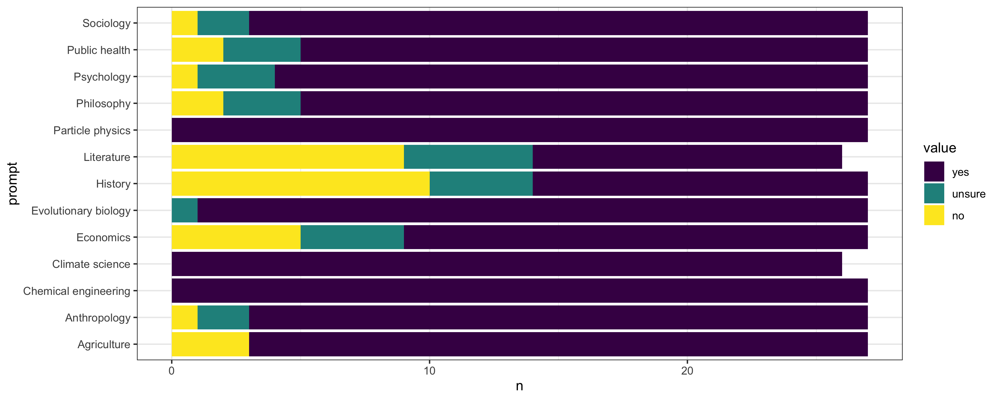

This semester I get to teach an undergraduate philosophy of science course for the first time ever, and today was the first meeting of the class.  I've always struggled with first days.  You can't get students to do any work beforehand, which makes it really hard to have a substantive discussion.  So you call roll to check the roster and then you go over the syllabus, which is somewhat useful but very boring.  And because my preferred teaching style involves as little lecturing as possible, me reading through the syllabus also radically misrepresents the feel of every other meeting of the class.  

Last fall, I had the idea of adapting the workshop format from the [Toolbox Dialogue Intiative](http://tdi.msu.edu/) at Michigan State.  The Toolbox workshops were originally developed for interdisciplinary team science groups.  During the workshop, the members of the group first complete [a survey on their views about science](https://i2s.anu.edu.au/wp-content/uploads/2014/02/ScientificResearch-Toolbox-SciTS-042512.pdf); then the workshop facilitator runs a philosophical discussion of points of agreement and disagreement among the group members.  

In the plan I conceived last fall, my students would engage with the Toolbox format twice:  once as participants in class and then as facilitators, running a version of the workshop with lab groups across campus.  The students wouldn't need any particular preparation for the survey, it would help preview the main topics of the course, and it would give us a good starting point for the kind of open-ended discussion that characterizes my preferred teaching style.  So it would work well as an activity for the first class meeting.  As facilitators, students would be organized into groups of 3 and each group would be assigned a lab or other research group on campus.  During the final week of classes, each group would give a presentation on highlights of their workshop discussion.  This would allow them to directly tie the class content into active scientific research across campus, which is one of the four [program learning outcomes](http://philo.ucmerced.edu/PLO.html) for our philosophy major.  

Unfortunately the second part didn't work out.  I have 35 students registered, meaning I'd need to recruit 12 research groups on campus as participants for my students' workshops.  After just one semester at UC Merced, I do know at least a dozen other faculty; but not enough well enough to get them to sacrifice one of their lab meetings.  The standard Toolbox workshop is most of a day; I felt like I could shorten it to 90 minutes or 2 hours while still keeping enough of the workshop to be useful for my students.  But that would still be a significant ask from people whom I barely know.  

But I was able to incorporate a "Toolbox-lite" into the first meeting of my class.  Starting with the Scientific Research Toolbox Instrument (linked above), I selected a few questions that were immediately relevant to my course, and wrote a few more.  While we're not talking directly about the definition of science or the demarcation problem (which I think is a pseudo-problem), I decided to add a set of questions about whether specific fields are sciences.  The resulting list was below; students responded on a 3-point Likert scale, with anchors at "agree" and "disagree" and the middle option unmarked.  

- All fields of science use the same basic scientific method.
- Scientific research primarily uses experimental methods.
- Scientific research primarily uses quantitative methods.
- There are strict requirements for determining when empirical data confirm a tested hypothesis.
- Scientific research aims to identify truths about a world independent of the investigators.
- Good scientists let the data speak for themselves.
- Scientific research reveals the laws that govern how the world operates.
- The world is fully explicable as the assembly of its constituent parts.
- The principal value of research stems from the potential application of the knowledge gained.
- Allowing values to influence research is unscientific.
- When it comes to making public policy, scientific facts are more important than people's feelings.
- Members of the general public shouldn't question scientific findings.
- Are these academic fields sciences?
	- Evolutionary biology
	- Agriculture
	- Public health
	- Chemical engineering
	- Particle physics
	- Climate science
	- Literature
	- History
	- Psychology
	- Economics
	- Anthropology
	- Sociology
	- Philosophy

I had the students fill this out on Qualtrics while I was passing out the hard copies of the syllabus.  I wrote a little dashboard in R to retrieve the responses from Qualtrics and display summary plots.  

Here are the results.  

I had the students divide into small groups, introduce themselves to their group members, and then discuss "Scientific research primarily uses quantitative methods" for about 10 minutes.  Then we came back together, I solicited a few highlights from these discussions, and then we had a short class discussion (maybe another 10 minutes) on "Allowing values to influence research is unscientific."  

The discussions were lively.  I heard a few students relating their views to their majors (the most popular major among registrants is cognitive science, followed by psychology and economics), which I think is really key to the way philosophy of science can engage students without much philosophy background.  

I think these results are really interesting.  The students generally agree with each other on a few points, but most prompts have a mix of responses.  The majority disagreement on "Allowing values to influence research is unscientific" and "Members of the general public shouldn't question scientific findings" are especially interesting.  We're talking about feminist philosophy of science, race (in) science, and values in science in the middle of the term; I'm looking forward to see what the students have to say about those topics.  

The field responses were also really interesting.  For every field, even Literature and History, a majority of students said the field is a science.  Philosophy gets treated more like a social science than the other two humanities fields, with a supermajority thinking that it is a science but a few students having doubts.  (As a registration requirement, all of the students had to have taken an intro-level philosophy course; but only one or two are philosophy majors.)  Unfortunately we didn't have any time to talk about these responses.  

All together, these responses and the discussions made me even more excited for this course.  The students are already thoughtful about what science is and how it works, and I think every one will have their views challenged by their classmates and readings at some point.  

