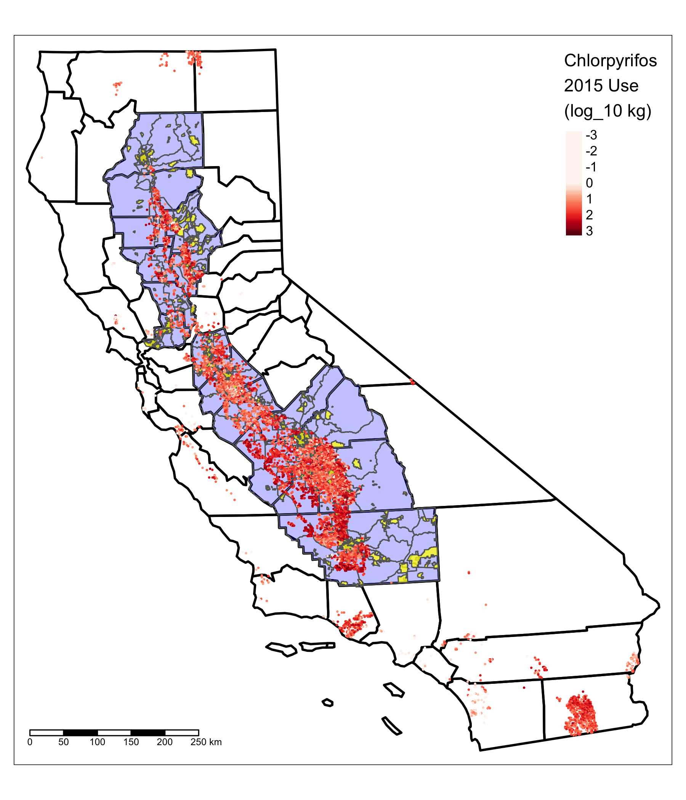

In Spring 2018, I audited a spatial data analysis class taught by Noli Brazil at UC Davis.  The pesticide chlorpyrifos was in the news at the time, as one of the first things Scott Pruitt did at EPA was to deny a petition to revoke all tolerances for the pesticide (effectively banning it in the US).  For my project for the class, I decided to apply some spatial regression techniques to understand where chlorpyrifos is used in California's central valley.  The initial results were quite compelling, indicating that Hispanic communities are potentially exposed to quite a bit more chlorpyrifos than White communities.  I also developed what seems to be a novel way to account for measurement error in the American Community Survey's public data.  

A few years later I finally found time to finish writing things up, and [the paper](https://doi.org/10.3390/ijerph17072593) was recently published in the *International Journal of Environmental Research and Public Health*.  (Incidentally, I was impressed at the fact that the journal got a pair of pretty decent reviews back in just a few weeks.  In philosophy of science, a fast turnaround time for reviews is 2-3 months.) 

Here's figure 1 of the paper, showing the study area in terms of census tracts (blue) and places (yellow) and where chlorpyrifos is used (red dots; more saturation = more chlorpyrifos).  

{:width="50%"}

**Abstract**:  

Chlorpyrifos is one of the most widely-used pesticides in the world, and is generally recognized to be a moderate neurotoxin. This paper reports a distributional environmental justice (dEJ) analysis of chlorpyrifos use in California's Central Valley, examining the way distributions of environmental risks are associated with race, ethnicity, class, gender, and other systems of structural oppression. Spatial data on chlorpyrifos use were retrieved from California's Department of Pesticide Registration (DPR) public pesticide use records (PUR) for 2011-2015.  These data were combined with demographic data for the Central Valley from the American Community Survey (ACS).  Spatial regression models were used to estimate effects of demographic covariates on local chlorpyrifos use.  A novel bootstrap method was used to account for measurement error in the ACS estimates.  There is consistent evidence that Hispanic population proportion is associated with increased local chlorpyrifos use.  A 10-point increase in Hispanic proportion is associated with an estimated 1.05-1.4-fold increase in local chlorpyrifos use across Census tract models. By contrast, effects of agricultural employment and poverty on local chlorpyrifos use are ambiguous and inconsistent between Census tracts and Census-designated places. 

<https://doi.org/10.3390/ijerph17072593>